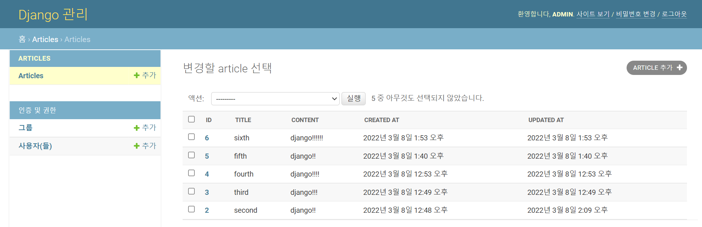

Model : 웹 애플리케이션 데이터를 구조화하고 조작하는 도구. Database를 흉내내면서, 매핑시키는 무언가.

스키마 : 데이터베이스에서 자료의 구조, 표현방법, 관계 등을 정리한 구조.(중복 여부, Null여부 등)

RDB는 Table과 관계된 것. ODB는 데이터분석같은 곳에서 사용합니다.

ORM은 Object-Relational-Mapping


먼저,

- id(pk) -> 자동으로 만들어지도록
- title(text)
- content(text)


Installed apps 순서

1. 내가 만든 것
2. 3rd party에서 제공한 것
3. default(django)에서 제공하는 것

--------

__Migrations(어떻게 DB에 반영할 수 있을까?)__

models.py에 class 지정되어있는지 확인하기

```python
class Article(models.Model):
    title = models.CharField(max_length=10)
    content = models.TextField()
    created_at = models.DateTimeField(auto_now_add=True)
    updated_at = models.DateTimeField(auto_now=True)
```

- charfield : 길이에 제한이 있는 문자열을 넣을 때 사용
- textfield : 글자수가 많을 때 사용. 나중에 위젯으로 제한 걸 수 있습니다.

```bash
python manage.py makemigrations
python manage.py migrate # 앱들을 DB에 반영하는 방법
```

db.sqlite3에서 articles_article이 만들어졌는지 확인하기.

이후, 2가지 라이브러리 설치

```python
pip install ipython
pip install django-extensions
```

```bash
python manage.py shell_plus
article = Article() # 인스턴스 생성
article.title = 'first' # title 메서드
article.content = 'django!' # content 메서드
article.save() # DB에 확정적으로 삽입. 메서드로 만들었다면 save를 넣어주어야 확정이 된다.
```

다른 방법으로 class로 직접 삽입하는 방법이 있다.

```bash
Article.object.create(title="third", content='django!!!') # article.save() 안해줘도 됨
```

실습에서는 이런 방식으로 4번 데이터를 입력했습니다.


__홈페이지에 반영하기__

1. models.py에서 함수 수정하기

```python
def __str__(self):
    return self.title
```

2. view.py에서 수정

```python
from .models import Article # models.py의 Article 클래스 임포트해주기

def index(request):
    articles = Article.objects.all() # Article 클래스 전체 읽어오기
    context = {
        'articles':article
    }
    return render(request, 'articles/index.html', context)
```

3. index.html에서 꾸며주기

```html

{% block content}
	<h1>게시판</h1>
	{{ articles }}
	
		<p> 글번호 : {{ article.id }} </p>
		<p> 제목 : {{ article.title }} </p>
		<p> 내용 : {{ article.content }} </p>
	

```

--------------

__READ__

read에는 queryset을 return하는거랑 query셋이 아닌애를 return하는 방법이 있다.

그 중 하나가 Article.objects.all() 인 셈.

```bash
article = Article.objects.get(id=1) # article 변수를 지정
article = Article.objects.get(content='django!!') # 되긴하는데 중복되면 오류
article = Article.objects.get(pk=3) # 그래서 이렇게 unique한 값을 통해서 찾아야 함
```

__content='django!!'처럼 중복되는 값으로 호출하고 싶다면?__

```bash
Article.objects.filter(content='django!!') # django!!인 content 전부
Article.object.filter(content__contains='django') # django 포함 전부
```

지우고 싶을 때

```bash
article.delete() # 그냥 메서드 써서 지우면 됨. 해당 튜플 삭제
```

--------------------

__관리자 아이디 생성__

```bash
python manage.py createsuperuser
```

admin.py에 등록해준 이후부터는 왼쪽에 Articles가 추가된다.

list display : models에 필요한것들 추가해줌.



이런 식으로 필요한 column을 만들 수 있다.

